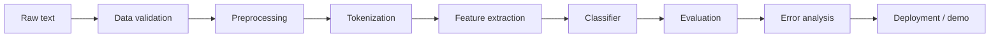

# Hate Speech vs Offensive Language Detection System Guide

> [!summary]
> This note explains how to build a supervised NLP system that separates **hate speech**, **offensive language**, and **neither/clean language**. It follows the course concepts from [[Information Extraction - 2_LangRes_TextPreproc-2026_en.pdf]], [[7_vectorsemantics.pdf]], [[10_TextClassification-2026-EN.pdf]], [[Transformers-2026-EN.pdf]], [[NLP_Comprehensive_Notes]], and the existing GoEmotions assignment workflow in [[Assignment_2_Instructions]] and [[Assignment_2_Starter_Guide]].

---

## 1. Goal

Build a classifier:

$$
\gamma: d \rightarrow c
$$

where:

- $d$ is an input text, such as a social media post, comment, message, or review.
- $C$ is a fixed set of labels.
- $\gamma$ is the trained classifier.

Recommended label set:

| Label | Meaning | Example pattern |
|---|---|---|
| `hate_speech` | Abusive or threatening language targeting a protected identity group | identity-targeted insult, dehumanization, explicit threat |
| `offensive_language` | Profanity, insults, toxic wording, or personal abuse without identity-group targeting | personal insult, profanity, harassment |
| `neither` | Non-hateful and non-offensive text | ordinary statement, disagreement without abuse |

This is a **document-level, one-of multiclass classification** task: each text receives exactly one label.

---

## 2. Course Concepts Used

| Course concept | Where it appears in this system |
|---|---|
| Corpus and annotation | A labeled dataset of comments/posts is required. |
| Preprocessing | Clean text, normalize URLs/users/numbers, tokenize, optionally lemmatize. |
| Token, word form, lemma, vocabulary | The model learns from tokenized text and a training vocabulary. |
| Bag of Words | Baseline representation using token counts. |
| N-grams | Unigrams, bigrams, and character n-grams capture phrases and spelling variants. |
| TF-IDF | Downweights very common words and emphasizes informative terms. |
| Naive Bayes | Simple interpretable baseline using feature independence assumption. |
| Logistic Regression / SVM | Strong linear baselines for sparse BoW or TF-IDF features. |
| Precision, recall, F1 | Main evaluation metrics, especially because hate speech is usually rare. |
| Confusion matrix | Shows whether hate speech is confused with offensive language. |
| BERT / Transformers | Stronger model using contextual embeddings and a classification head. |

---

## 3. System Overview



Two practical versions should be built:

| Version | Model | Why build it |
|---|---|---|
| Baseline | `CountVectorizer` or `TfidfVectorizer` + `MultinomialNB` | Matches the course text classification assignment; fast and interpretable. |
| Improved classic ML | `TfidfVectorizer` + `LogisticRegression` or `LinearSVC` | Often stronger than Naive Bayes for toxicity/hate classification. |
| Transformer extension | `bert-base-uncased`, `roberta-base`, or a domain-specific hate/offensive model | Captures context, subwords, and nonlocal meaning better than BoW. |

---

## 4. Dataset Choice

You need a supervised dataset with text and labels. Common options:

| Dataset | Typical labels | Use case |
|---|---|---|
| Davidson Hate Speech and Offensive Language dataset | `hate_speech`, `offensive_language`, `neither` | Best match for this exact task. |
| OLID / OffensEval | offensive / not offensive, targeted / untargeted | Good for offensive-language detection. |
| HateXplain | hate, offensive, normal plus rationales | Useful for explainability. |
| Civil Comments / Jigsaw Toxicity | toxic, severe toxic, insult, threat, identity hate, etc. | Broader toxicity detection. |

Recommended starting point: use the Davidson-style 3-class setup because it directly separates **hate speech** from **offensive language**.

Expected input format:

```text
text,label
"I disagree with this decision.",neither
"You are a [sanitized insult].",offensive_language
"[identity group] should be [harmful target statement].",hate_speech
```

> [!warning]
> Do not create examples containing real slurs in project documentation unless the assignment explicitly requires raw data examples. Keep report examples sanitized. The model can still train on the original dataset, but your written report should avoid reproducing harmful text unnecessarily.

---

## 5. Project Structure

Recommended folder layout:

```text
hate_offensive_detection/
  data/
    raw/
      dataset.csv
    processed/
      train.csv
      dev.csv
      test.csv
  notebooks/
    01_data_analysis.ipynb
    02_baseline_models.ipynb
    03_transformer_model.ipynb
  models/
    baseline_nb.joblib
    logistic_tfidf.joblib
  reports/
    figures/
      class_distribution.png
      confusion_matrix.png
  src/
    preprocess.py
    train_baseline.py
    evaluate.py
    predict.py
  README.md
```

For a course submission, a well-documented notebook is acceptable. For a reusable system, use the `src/` structure.

---

## 6. Tools and Libraries

### Required Baseline Libraries

```python
import re
import os
import html
import joblib
import numpy as np
import pandas as pd
import matplotlib.pyplot as plt
import seaborn as sns

from sklearn.model_selection import train_test_split, GridSearchCV
from sklearn.pipeline import Pipeline
from sklearn.feature_extraction.text import CountVectorizer, TfidfVectorizer
from sklearn.naive_bayes import MultinomialNB
from sklearn.linear_model import LogisticRegression
from sklearn.svm import LinearSVC
from sklearn.metrics import (
    classification_report,
    confusion_matrix,
    accuracy_score,
    precision_recall_fscore_support,
    f1_score
)
```

### Optional Preprocessing Libraries

```python
import nltk
from nltk.tokenize import word_tokenize
from nltk.stem import WordNetLemmatizer
from nltk.corpus import stopwords

nltk.download("punkt")
nltk.download("punkt_tab")
nltk.download("wordnet")
nltk.download("stopwords")
```

Alternative:

```python
import spacy
# python -m spacy download en_core_web_sm
nlp = spacy.load("en_core_web_sm", disable=["parser", "ner"])
```

### Transformer Libraries

```python
import torch
from datasets import Dataset, DatasetDict
from transformers import (
    AutoTokenizer,
    AutoModelForSequenceClassification,
    TrainingArguments,
    Trainer,
    DataCollatorWithPadding
)
```

Install command:

```bash
pip install pandas numpy scikit-learn matplotlib seaborn nltk joblib
pip install torch transformers datasets evaluate accelerate
```

---

## 7. Data Loading

Your dataset should have at least two columns:

| Column | Meaning |
|---|---|
| `text` | The original comment/post/message. |
| `label` | One of `hate_speech`, `offensive_language`, `neither`. |

```python
import pandas as pd

DATA_PATH = "hate_offensive_detection/data/raw/dataset.csv"

df = pd.read_csv(DATA_PATH)
df = df[["text", "label"]].dropna()

allowed_labels = {"hate_speech", "offensive_language", "neither"}
df = df[df["label"].isin(allowed_labels)].copy()

print(df.shape)
print(df["label"].value_counts())
```

If the dataset uses numeric labels, map them explicitly:

```python
label_map = {
    0: "hate_speech",
    1: "offensive_language",
    2: "neither"
}

df["label"] = df["class"].map(label_map)
df = df[["tweet", "label"]].rename(columns={"tweet": "text"})
```

---

## 8. Data Splitting

Use train/dev/test splits. Stratification is important because hate speech is often the minority class.

```python
from sklearn.model_selection import train_test_split

train_df, temp_df = train_test_split(
    df,
    test_size=0.30,
    random_state=42,
    stratify=df["label"]
)

dev_df, test_df = train_test_split(
    temp_df,
    test_size=0.50,
    random_state=42,
    stratify=temp_df["label"]
)

print("Train:", train_df["label"].value_counts())
print("Dev:", dev_df["label"].value_counts())
print("Test:", test_df["label"].value_counts())
```

> [!important]
> Fit the vectorizer and model only on `train_df`. Use `dev_df` for tuning. Use `test_df` once for the final result.

---

## 9. Preprocessing

From the course preprocessing material:

- Tokenization converts text into tokens.
- Normalization reduces unnecessary variation.
- Lemmatization maps word forms to dictionary forms.
- URLs, usernames, numbers, and emojis need explicit handling.
- Hate/offensive text often includes creative spelling, repeated letters, hashtags, and profanity, so over-cleaning can remove useful signals.

Recommended cleaning decisions:

| Text phenomenon | Recommended handling | Reason |
|---|---|---|
| URLs | Replace with `URL` | Presence of links may matter, exact URL usually does not. |
| User mentions | Replace with `USER` | Avoid memorizing usernames. |
| Numbers | Replace with `NUM` | Reduces sparsity. |
| HTML entities | Decode | Social media data may contain escaped text. |
| Lowercase | Yes for BoW baselines | Reduces vocabulary size. |
| Punctuation | Keep some or remove depending on experiment | Exclamation marks and repeated punctuation may signal aggression. |
| Stopwords | Usually keep | Pronouns and negation matter in abuse detection. |
| Lemmatization | Try as experiment | Can reduce sparsity, but may not help slang/profanity. |
| Slurs/profanity | Do not censor in training data | These are predictive features, but sanitize examples in reports. |

Basic cleaner:

```python
import re
import html

def clean_text(text: str) -> str:
    text = str(text)
    text = html.unescape(text)
    text = text.lower()
    text = re.sub(r"https?://\S+|www\.\S+", " URL ", text)
    text = re.sub(r"@\w+", " USER ", text)
    text = re.sub(r"#(\w+)", r"\1", text)
    text = re.sub(r"\d+", " NUM ", text)
    text = re.sub(r"\s+", " ", text).strip()
    return text

train_df["clean_text"] = train_df["text"].apply(clean_text)
dev_df["clean_text"] = dev_df["text"].apply(clean_text)
test_df["clean_text"] = test_df["text"].apply(clean_text)
```

Optional lemmatization:

```python
from nltk.tokenize import word_tokenize
from nltk.stem import WordNetLemmatizer

lemmatizer = WordNetLemmatizer()

def clean_and_lemmatize(text: str) -> str:
    text = clean_text(text)
    text = re.sub(r"[^a-zA-Z0-9_\s]", " ", text)
    tokens = word_tokenize(text)
    lemmas = [lemmatizer.lemmatize(tok) for tok in tokens]
    return " ".join(lemmas)
```

For hate/offensive language, also test character n-grams because users often obfuscate words.

---

## 10. Shallow Data Analysis

Do this before training:

1. Count samples per class.
2. Inspect text length per class.
3. Compute vocabulary size.
4. Find top unigrams and bigrams per class.
5. Check duplicates and near-duplicates.
6. Check whether offensive language dominates hate speech.

```python
import matplotlib.pyplot as plt
import seaborn as sns

plt.figure(figsize=(7, 4))
sns.countplot(data=train_df, x="label", order=train_df["label"].value_counts().index)
plt.title("Class Distribution")
plt.xticks(rotation=20)
plt.tight_layout()
plt.show()
```

Top n-grams:

```python
from sklearn.feature_extraction.text import CountVectorizer
import pandas as pd

def top_ngrams(texts, ngram_range=(1, 1), top_k=20, min_df=2):
    vec = CountVectorizer(ngram_range=ngram_range, min_df=min_df)
    X = vec.fit_transform(texts)
    counts = X.sum(axis=0).A1
    vocab = vec.get_feature_names_out()
    result = pd.DataFrame({"ngram": vocab, "count": counts})
    return result.sort_values("count", ascending=False).head(top_k)

for label in ["hate_speech", "offensive_language", "neither"]:
    print("\n", label)
    print(top_ngrams(train_df[train_df["label"] == label]["clean_text"], (1, 2), 15))
```

> [!note]
> In your report, do not paste raw harmful n-grams. Summarize patterns or sanitize terms.

---

## 11. Baseline 1: Bag of Words + Multinomial Naive Bayes

This is closest to the course text classification workflow.

Naive Bayes uses:

$$
\hat{c} = \arg\max_c P(c)\prod_i P(x_i \mid c)
$$

In log space:

$$
\hat{c} = \arg\max_c \log P(c) + \sum_i \log P(x_i \mid c)
$$

Code:

```python
from sklearn.pipeline import Pipeline
from sklearn.feature_extraction.text import CountVectorizer
from sklearn.naive_bayes import MultinomialNB
from sklearn.metrics import classification_report, confusion_matrix

nb_pipeline = Pipeline([
    ("vec", CountVectorizer(
        ngram_range=(1, 2),
        min_df=2,
        max_df=0.95
    )),
    ("clf", MultinomialNB(alpha=1.0))
])

nb_pipeline.fit(train_df["clean_text"], train_df["label"])
dev_pred = nb_pipeline.predict(dev_df["clean_text"])

print(classification_report(dev_df["label"], dev_pred, digits=4))
```

Why this baseline matters:

- Simple and fast.
- Easy to explain in a report.
- Works surprisingly well with word counts.
- Shows whether the dataset has strong lexical signals.

Main weakness:

- Ignores context and word order beyond n-grams.
- Can over-rely on profanity.
- May confuse offensive language with hate speech.

---

## 12. Baseline 2: TF-IDF + Logistic Regression

TF-IDF represents texts as sparse weighted vectors:

$$
tfidf(t,d)=tf(t,d)\times idf(t)
$$

This often improves linear classifiers because very common words receive lower weights.

```python
from sklearn.feature_extraction.text import TfidfVectorizer
from sklearn.linear_model import LogisticRegression

logreg_pipeline = Pipeline([
    ("tfidf", TfidfVectorizer(
        ngram_range=(1, 2),
        min_df=2,
        max_df=0.95,
        sublinear_tf=True
    )),
    ("clf", LogisticRegression(
        max_iter=2000,
        class_weight="balanced",
        C=1.0,
        random_state=42
    ))
])

logreg_pipeline.fit(train_df["clean_text"], train_df["label"])
dev_pred = logreg_pipeline.predict(dev_df["clean_text"])

print(classification_report(dev_df["label"], dev_pred, digits=4))
```

Why use `class_weight="balanced"`:

- Hate speech is usually less frequent than offensive language.
- Without class weighting, a model can get high accuracy by mostly predicting the majority class.

---

## 13. Baseline 3: Character N-Grams

Character n-grams are useful for:

- misspellings;
- obfuscated profanity;
- repeated letters;
- hashtags;
- informal social media language.

```python
char_pipeline = Pipeline([
    ("tfidf", TfidfVectorizer(
        analyzer="char_wb",
        ngram_range=(3, 5),
        min_df=2,
        sublinear_tf=True
    )),
    ("clf", LogisticRegression(
        max_iter=2000,
        class_weight="balanced",
        random_state=42
    ))
])

char_pipeline.fit(train_df["clean_text"], train_df["label"])
dev_pred = char_pipeline.predict(dev_df["clean_text"])

print(classification_report(dev_df["label"], dev_pred, digits=4))
```

Strong practical setup:

```python
from sklearn.pipeline import FeatureUnion

word_char_pipeline = Pipeline([
    ("features", FeatureUnion([
        ("word_tfidf", TfidfVectorizer(
            analyzer="word",
            ngram_range=(1, 2),
            min_df=2,
            max_df=0.95,
            sublinear_tf=True
        )),
        ("char_tfidf", TfidfVectorizer(
            analyzer="char_wb",
            ngram_range=(3, 5),
            min_df=2,
            sublinear_tf=True
        ))
    ])),
    ("clf", LogisticRegression(
        max_iter=3000,
        class_weight="balanced",
        random_state=42
    ))
])
```

---

## 14. Hyperparameter Tuning

Tune on the dev set or use cross-validation inside the training set.

```python
from sklearn.model_selection import GridSearchCV

pipeline = Pipeline([
    ("tfidf", TfidfVectorizer()),
    ("clf", LogisticRegression(max_iter=3000, class_weight="balanced", random_state=42))
])

param_grid = {
    "tfidf__ngram_range": [(1, 1), (1, 2)],
    "tfidf__min_df": [1, 2, 5],
    "tfidf__max_df": [0.90, 0.95, 1.0],
    "tfidf__sublinear_tf": [True, False],
    "clf__C": [0.1, 1.0, 3.0]
}

grid = GridSearchCV(
    pipeline,
    param_grid=param_grid,
    scoring="f1_macro",
    cv=5,
    n_jobs=-1,
    verbose=1
)

grid.fit(train_df["clean_text"], train_df["label"])

print(grid.best_params_)
print(grid.best_score_)

best_model = grid.best_estimator_
dev_pred = best_model.predict(dev_df["clean_text"])
print(classification_report(dev_df["label"], dev_pred, digits=4))
```

Use `f1_macro`, not only accuracy, because minority classes matter.

---

## 15. Final Evaluation

Evaluate the chosen model once on the test set.

```python
labels = ["hate_speech", "offensive_language", "neither"]

test_pred = best_model.predict(test_df["clean_text"])

print("Accuracy:", accuracy_score(test_df["label"], test_pred))
print("Macro F1:", f1_score(test_df["label"], test_pred, average="macro"))
print("Micro F1:", f1_score(test_df["label"], test_pred, average="micro"))
print()
print(classification_report(test_df["label"], test_pred, labels=labels, digits=4))
```

Confusion matrix:

```python
cm = confusion_matrix(test_df["label"], test_pred, labels=labels)

plt.figure(figsize=(7, 5))
sns.heatmap(
    cm,
    annot=True,
    fmt="d",
    cmap="Blues",
    xticklabels=labels,
    yticklabels=labels
)
plt.xlabel("Predicted")
plt.ylabel("True")
plt.title("Hate Speech vs Offensive Language Confusion Matrix")
plt.tight_layout()
plt.show()
```

Interpretation questions:

- How often is `hate_speech` predicted as `offensive_language`?
- How often is `offensive_language` predicted as `hate_speech`?
- Does the model mostly predict the majority class?
- Which class has the lowest recall?
- Which class has the lowest precision?

---

## 16. Error Analysis

Create a table of incorrect predictions.

```python
errors = test_df.copy()
errors["prediction"] = test_pred
errors = errors[errors["label"] != errors["prediction"]]

errors[["text", "label", "prediction"]].head(20)
```

Recommended error categories:

| Error type | Description |
|---|---|
| Profanity without hate | Model predicts hate because profanity appears. |
| Hate without profanity | Model misses subtle identity-targeted hate. |
| Quotation/reporting | Text quotes hate speech to condemn it. |
| Sarcasm/irony | Literal words differ from intended meaning. |
| Reclaimed language | In-group usage is not necessarily hate. |
| Target ambiguity | It is unclear whether text targets a person, group, or idea. |
| Annotation ambiguity | Dataset labels may be inconsistent. |

> [!important]
> For this task, `offensive_language -> hate_speech` false positives and `hate_speech -> offensive_language` false negatives have different social consequences. Discuss both.

---

## 17. Model Saving and Prediction

Save the best classic ML model:

```python
import joblib

joblib.dump(best_model, "models/best_tfidf_model.joblib")
```

Load and predict:

```python
model = joblib.load("models/best_tfidf_model.joblib")

def predict_label(text: str):
    clean = clean_text(text)
    return model.predict([clean])[0]

print(predict_label("I strongly disagree with this policy."))
```

For probability estimates, use Logistic Regression or Naive Bayes:

```python
probs = model.predict_proba([clean_text("example text")])[0]
for label, prob in zip(model.classes_, probs):
    print(label, prob)
```

`LinearSVC` does not provide probabilities by default.

---

## 18. Transformer Extension: BERT/RoBERTa

Transformers use contextual embeddings. For classification, BERT-style models use the `[CLS]` representation or pooled sequence representation with a classification head.

Recommended models:

| Model | Reason |
|---|---|
| `bert-base-uncased` | Standard baseline for English classification. |
| `roberta-base` | Often stronger than BERT. |
| `distilbert-base-uncased` | Faster and smaller. |
| Hate/offensive-language models on Hugging Face | Useful if allowed, but cite and evaluate carefully. |

Prepare labels:

```python
label2id = {
    "hate_speech": 0,
    "offensive_language": 1,
    "neither": 2
}
id2label = {v: k for k, v in label2id.items()}

train_hf = train_df[["clean_text", "label"]].rename(columns={"clean_text": "text"})
dev_hf = dev_df[["clean_text", "label"]].rename(columns={"clean_text": "text"})
test_hf = test_df[["clean_text", "label"]].rename(columns={"clean_text": "text"})

train_hf["labels"] = train_hf["label"].map(label2id)
dev_hf["labels"] = dev_hf["label"].map(label2id)
test_hf["labels"] = test_hf["label"].map(label2id)
```

Create Hugging Face datasets:

```python
from datasets import Dataset, DatasetDict

dataset = DatasetDict({
    "train": Dataset.from_pandas(train_hf[["text", "labels"]]),
    "validation": Dataset.from_pandas(dev_hf[["text", "labels"]]),
    "test": Dataset.from_pandas(test_hf[["text", "labels"]])
})
```

Tokenization:

```python
from transformers import AutoTokenizer, DataCollatorWithPadding

model_name = "distilbert-base-uncased"
tokenizer = AutoTokenizer.from_pretrained(model_name)

def tokenize_batch(batch):
    return tokenizer(
        batch["text"],
        truncation=True,
        max_length=128
    )

tokenized = dataset.map(tokenize_batch, batched=True)
data_collator = DataCollatorWithPadding(tokenizer=tokenizer)
```

Model:

```python
from transformers import AutoModelForSequenceClassification

model = AutoModelForSequenceClassification.from_pretrained(
    model_name,
    num_labels=3,
    id2label=id2label,
    label2id=label2id
)
```

Metrics:

```python
import numpy as np
from sklearn.metrics import accuracy_score, precision_recall_fscore_support

def compute_metrics(eval_pred):
    logits, labels = eval_pred
    preds = np.argmax(logits, axis=-1)
    precision, recall, f1, _ = precision_recall_fscore_support(
        labels,
        preds,
        average="macro",
        zero_division=0
    )
    acc = accuracy_score(labels, preds)
    return {
        "accuracy": acc,
        "macro_precision": precision,
        "macro_recall": recall,
        "macro_f1": f1
    }
```

Training:

```python
from transformers import TrainingArguments, Trainer

training_args = TrainingArguments(
    output_dir="models/distilbert_hate_offensive",
    learning_rate=2e-5,
    per_device_train_batch_size=16,
    per_device_eval_batch_size=16,
    num_train_epochs=3,
    weight_decay=0.01,
    eval_strategy="epoch",
    save_strategy="epoch",
    load_best_model_at_end=True,
    metric_for_best_model="macro_f1",
    greater_is_better=True,
    logging_steps=50
)

trainer = Trainer(
    model=model,
    args=training_args,
    train_dataset=tokenized["train"],
    eval_dataset=tokenized["validation"],
    tokenizer=tokenizer,
    data_collator=data_collator,
    compute_metrics=compute_metrics
)

trainer.train()
trainer.evaluate(tokenized["test"])
```

Prediction:

```python
import torch

def transformer_predict(text: str):
    inputs = tokenizer(clean_text(text), return_tensors="pt", truncation=True, max_length=128)
    inputs = {k: v.to(model.device) for k, v in inputs.items()}
    model.eval()
    with torch.no_grad():
        logits = model(**inputs).logits
    pred_id = int(torch.argmax(logits, dim=-1).item())
    return id2label[pred_id]
```

---

## 19. Comparing Experiments

Use a table like this in the report:

| Experiment | Features | Model | Macro F1 | Hate recall | Offensive recall | Notes |
|---|---|---|---:|---:|---:|---|
| E1 | unigram counts | MultinomialNB |  |  |  | Course baseline |
| E2 | unigram + bigram counts | MultinomialNB |  |  |  | Tests phrase features |
| E3 | word TF-IDF | LogisticRegression |  |  |  | Strong sparse baseline |
| E4 | char TF-IDF | LogisticRegression |  |  |  | Handles spelling variants |
| E5 | word + char TF-IDF | LogisticRegression |  |  |  | Recommended classic model |
| E6 | subword tokens | DistilBERT/RoBERTa |  |  |  | Contextual transformer |

Expected findings:

- Accuracy can be misleading if `offensive_language` or `neither` dominates.
- Macro F1 is more useful for class imbalance.
- Character n-grams often help with social media text.
- Transformers usually improve context-sensitive cases but require more compute.
- Hate speech is harder than offensive language because hate depends on target identity and context, not only profanity.

---

## 20. Important Design Choices

### Label Design

Use `hate_speech`, `offensive_language`, and `neither` as separate classes. Do not collapse hate speech and offensive language into one `toxic` label if the goal is to distinguish them.

### Preprocessing

Do not remove too much:

- Removing all punctuation can remove intensity markers.
- Removing stopwords can remove negation and target structure.
- Replacing identity terms can hide the exact signal needed for hate speech, but keeping them can increase bias. Evaluate carefully.

### Features

Use:

- word unigrams;
- word bigrams;
- character n-grams;
- TF-IDF weighting;
- optional transformer subword tokenization.

### Metrics

Report:

- accuracy;
- precision, recall, F1 per class;
- macro F1;
- micro F1;
- confusion matrix.

For this task, prioritize:

1. `hate_speech` recall;
2. `hate_speech` precision;
3. macro F1;
4. confusion between `hate_speech` and `offensive_language`.

---

## 21. Bias, Fairness, and Safety

Hate speech detection systems can cause harm if used carelessly.

Key risks:

| Risk | Explanation | Mitigation |
|---|---|---|
| Dialect bias | Minority dialects may be falsely flagged as offensive. | Evaluate by subgroup if metadata exists; inspect false positives. |
| Identity-term bias | Neutral mentions of identity groups may be flagged as hate. | Include neutral identity mentions in training/evaluation. |
| Context loss | Quoting or condemning hate speech can be misclassified. | Add context-aware model and error analysis. |
| Annotation subjectivity | Annotators may disagree on hate vs offensive. | Report ambiguity and use clear label definitions. |
| Overblocking | False positives can silence users. | Use confidence thresholds and human review for high-impact decisions. |

Recommended deployment policy:

- Use model output as a moderation signal, not as the only decision-maker.
- Add a confidence score.
- Route uncertain or severe cases to human review.
- Log model version, preprocessing version, and threshold.
- Re-evaluate periodically because language changes.

---

## 22. Minimal End-to-End Notebook Skeleton

```python
# 1. Imports
import re
import html
import joblib
import pandas as pd
import seaborn as sns
import matplotlib.pyplot as plt

from sklearn.model_selection import train_test_split, GridSearchCV
from sklearn.pipeline import Pipeline
from sklearn.feature_extraction.text import TfidfVectorizer
from sklearn.linear_model import LogisticRegression
from sklearn.metrics import classification_report, confusion_matrix, accuracy_score, f1_score

# 2. Load data
df = pd.read_csv("hate_offensive_detection/data/raw/dataset.csv")
df = df[["text", "label"]].dropna()

# 3. Clean text
def clean_text(text):
    text = html.unescape(str(text)).lower()
    text = re.sub(r"https?://\S+|www\.\S+", " URL ", text)
    text = re.sub(r"@\w+", " USER ", text)
    text = re.sub(r"#(\w+)", r"\1", text)
    text = re.sub(r"\d+", " NUM ", text)
    text = re.sub(r"\s+", " ", text).strip()
    return text

df["clean_text"] = df["text"].apply(clean_text)

# 4. Split data
train_df, temp_df = train_test_split(
    df,
    test_size=0.30,
    random_state=42,
    stratify=df["label"]
)
dev_df, test_df = train_test_split(
    temp_df,
    test_size=0.50,
    random_state=42,
    stratify=temp_df["label"]
)

# 5. Train model
model = Pipeline([
    ("tfidf", TfidfVectorizer(
        ngram_range=(1, 2),
        min_df=2,
        max_df=0.95,
        sublinear_tf=True
    )),
    ("clf", LogisticRegression(
        max_iter=3000,
        class_weight="balanced",
        random_state=42
    ))
])

model.fit(train_df["clean_text"], train_df["label"])

# 6. Validate
dev_pred = model.predict(dev_df["clean_text"])
print(classification_report(dev_df["label"], dev_pred, digits=4))

# 7. Final test
labels = ["hate_speech", "offensive_language", "neither"]
test_pred = model.predict(test_df["clean_text"])

print("Accuracy:", accuracy_score(test_df["label"], test_pred))
print("Macro F1:", f1_score(test_df["label"], test_pred, average="macro"))
print(classification_report(test_df["label"], test_pred, labels=labels, digits=4))

cm = confusion_matrix(test_df["label"], test_pred, labels=labels)
sns.heatmap(cm, annot=True, fmt="d", xticklabels=labels, yticklabels=labels)
plt.xlabel("Predicted")
plt.ylabel("True")
plt.title("Confusion Matrix")
plt.show()

# 8. Save model
joblib.dump(model, "models/logreg_tfidf.joblib")
```

---

## 23. Report Structure

Use this structure for the final write-up:

```text
1. Introduction
   - Task definition
   - Labels: hate_speech, offensive_language, neither

2. Dataset
   - Source
   - Number of examples
   - Class distribution
   - Any filtering or label mapping

3. Preprocessing
   - Cleaning choices
   - Tokenization
   - Normalization
   - Lemmatization experiment if used

4. Data Analysis
   - Class counts
   - Text lengths
   - Vocabulary size
   - Top sanitized unigram/bigram patterns

5. Models
   - Naive Bayes baseline
   - TF-IDF + Logistic Regression
   - Character n-gram model
   - Transformer model if used

6. Evaluation
   - Accuracy
   - Precision / Recall / F1 per class
   - Macro and micro averages
   - Confusion matrix

7. Error Analysis
   - Main confusion patterns
   - Examples, sanitized
   - Bias and fairness observations

8. Conclusion
   - Best model
   - Trade-offs
   - Future improvements
```

---

## 24. Common Mistakes

| Mistake | Why it is wrong |
|---|---|
| Fitting vectorizer on all data | Leaks test information into training. |
| Reporting only accuracy | Hides poor hate-speech recall. |
| Removing all profanity before training | Removes important offensive-language signals. |
| Treating offensive language as hate speech | The task requires distinguishing them. |
| Ignoring class imbalance | Model may ignore minority hate class. |
| No error analysis | Metrics alone do not explain failure modes. |
| Using transformer test score for tuning | Test set must be final only. |
| Showing raw slurs in report | Unnecessary harm; sanitize examples. |

---

## 25. Recommended Final Approach

For a strong course project:

1. Build a **MultinomialNB + CountVectorizer** model as the course baseline.
2. Build a **TF-IDF + LogisticRegression** model as the improved classic ML system.
3. Add **character n-grams** to handle social media spelling variation.
4. Optionally fine-tune **DistilBERT** or **RoBERTa**.
5. Compare all models using **macro F1**, per-class F1, and confusion matrices.
6. Write a careful error analysis focused on confusion between `hate_speech` and `offensive_language`.

Best practical default:

```text
clean_text
-> word TF-IDF unigrams+bigrams
-> character TF-IDF 3-5 grams
-> LogisticRegression(class_weight="balanced")
-> evaluate with macro F1 and confusion matrix
```

Best advanced model:

```text
clean_text
-> transformer tokenizer
-> DistilBERT/RoBERTa sequence classification
-> tune on dev set
-> test once
```

---

## 26. Runnable Implementation

I added a runnable starter project in [[hate_offensive_detection/README]].

Main files:

| File | Purpose |
|---|---|
| [[hate_offensive_detection/src/preprocess.py]] | Shared text cleaning function |
| [[hate_offensive_detection/src/train.py]] | Trains Naive Bayes and TF-IDF Logistic Regression models |
| [[hate_offensive_detection/src/predict.py]] | Loads the saved model and predicts one input text |

Basic command after adding the Davidson dataset:

```bash
python3 hate_offensive_detection/src/train.py \
  --data hate_offensive_detection/data/raw/labeled_data.csv \
  --text-col tweet \
  --label-col class \
  --label-map davidson
```

---

## 27. Local Source Map

| Local material | Relevant concepts |
|---|---|
| [[Information Extraction - 2_LangRes_TextPreproc-2026_en.pdf]] | corpora, tokenization, normalization, word forms, lemmas, subwords |
| [[7_vectorsemantics.pdf]] | sparse vectors, TF-IDF, dense embeddings, semantic similarity |
| [[10_TextClassification-2026-EN.pdf]] | BoW, Naive Bayes, logistic regression, evaluation, confusion matrix |
| [[Transformers-2026-EN.pdf]] | BERT, contextual embeddings, `[CLS]`, transformer classification head |
| [[NLP_Comprehensive_Notes]] | consolidated formulas and course pipeline |
| [[Assignment_2_Instructions]] | supervised classification workflow and metrics |
| [[Assignment_2_Starter_Guide]] | practical Python baseline pattern |
| [[assignments/textClassification/Akhil_KK_text_classification.ipynb]] | existing notebook pattern for loading, preprocessing, analysis, training, and evaluation |
